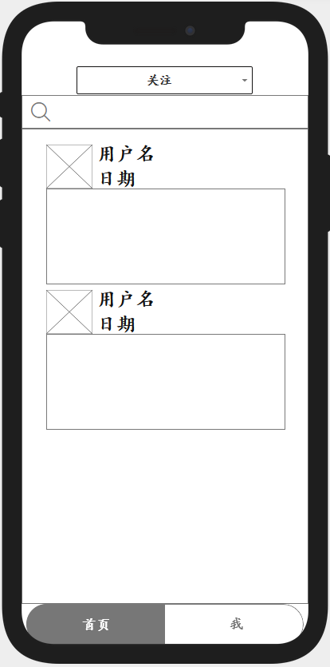
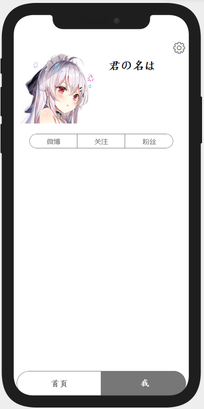

# The weibo2 for Android

> weibo2为提高所有人的微博体验而生

---
## 小组信息

组名：<u>小组一</u>

成员：

| Name | ID   | Role | Concrete Tasks |
| :--: | :--: | :--: | :------------: |
|   何启凡   |   10184304123   |   Leader   |        Writing Readme       |
| 孟庆奥森 | 10195101544 | Designer | Designing interface |
| 詹鹏飞 | 10195101459 | Documentation | Writing documentations |
| 赵梓涵 | 10195101562 | Developer |  |
| 徐涛 | 10195101532 | Developer |  |
| 唐瑞奇 | 10181900241 | Developer |  |

---
## 简介

> 天下苦微博久矣

微博官方客户端十分臃肿，许多用户对于广告和其他推广信息不堪其扰。市面上现存的第三方客户端虽然很好地提供了干净、纯粹的使用体验，但是对于某些好用的功能比如设定屏蔽词是额外收费的。

- 我们的目标用户是所有人

- 我们希望提供**功能丰富、可定制**，**免费**，**简洁**，**高效**的微博客户端

- 开发Android程序使得测试可以在任何安卓手机上进行，制作第三方客户端不用担心测试数据来源

- 我们的目前准备开发支持的功能：

  > 1. 登录
  > 2. 主题设置（含夜间模式）
  > 3. 关键词屏蔽（支持正则表达式）
  > 4. 按分组显示关注用户
  > 5. 升序、降序查看主页微博
  > 6. 下载图片（含批量下载）
  > 7. 拍照上传
  > 8. 自动转发抽奖微博
  > 9. 与其他应用分享
  > 10. 只查看原创微博
  > 11. 查看某用户某时间段的微博
  > 12. 热搜
  > 13. 私信功能模块完全关闭

---
## 用户界面 (非最终结果)

- 主面板 

- 用户主页

- 搜索和热搜

- 设置

---

2021/3/12 仓库建立
